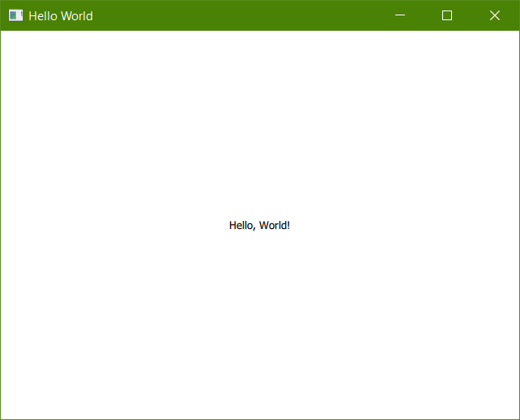

.. image:: https://travis-ci.org/mandeep/cookiecutter-pyqt5.svg?branch=master
    :target: https://travis-ci.org/mandeep/cookiecutter-pyqt5

Cookiecutter-QML is a Cookiecutter_ template that assists users in their creation of PySide2 QML GUI applications. All projects created from this cookiecutter will default to the GPLv3 license. For more details regarding Riverbank's license please visit: https://www.riverbankcomputing.com/commercial/license-faq

.. _Cookiecutter: https://github.com/audreyr/cookiecutter

Features
--------

* GUI application template
* Package creation with ready-made setup.py
* Continuous integration with pre-built .travis.yml for Travis CI
* Pre-assembled Pytest test suite with inclusion of pytest-qt and pytest-xvfb to enhance test experience

Quick Start
------------

Prior to installing the cookiecutter-qml, the cookiecutter package must be installed in the user's virtual environment. This is achieved via the following command::

    $ pip install cookiecutter

With cookiecutter installed, the cookiecutter-qml template can be installed with::

    $ cookiecutter https://github.com/AkiraGiShinichi/cookiecutter-qml.git

Once cookiecutter clones the template, the user will be asked a series of questions related to their
project::

    $ full_name [Akira]: Enter your full name.

    $ email [akira@gmail.com]: Enter your email address.

    $ github_username [akira]: Enter your github username.

    $ repo_name [cookiecutter_qml]: Enter the name of your project's repository.

    $ package_name [cookiecutter_qml]: Enter the name of your application's package.

    $ application_name [application]: Enter the name of your GUI application.

    $ application_title [Template]: Enter the title of your application. This name is also used
      as an entry point into the application.

    $ application_title [PySide2]: Enter the target PySide version

    $ project_short_description [A PySide2 GUI application]: Enter a short description about your project.

    $ version [0.0.1]: Enter the version number for your application.

Once project is created, it is able to interact::

    - Jump in and create new python environment:

    $ cd <repo_name>

    $ python -m venv .env

    $ .env\Scripts\activate

    - Install requires pakages:

    $ python setup.py develop

    - Run GUI:

    $ python main.py

    - Test:

    $ python setup.py pytest

    - Make documents:

    $ cd docs

    $ sphinx-quickstart

    $ make html

    - Custom document theme:

    $ pip install sphinx_rtd_theme

    Update `conf.py`:
    """python
    import sphinx_rtd_theme

    html_theme = 'sphinx_rtd_theme'

    html_theme_path = [sphinx_rtd_theme.get_html_theme_path()]
    """

    $ make html

Usage
-------

With the questions during installation answered, the user will have a fully functioning Python project
in their current working directory. This package will contain a GUI application template in the package
directory as well as a test suite in the package's tests folder. All the user needs to finish coding is the rest of their GUI application and related tests.

Screenshot
-----------

The Qt library creates applications native to the desktop environment of the user's operating system. Below is a screenshot of the template application opened on Linux Mint 18 Cinnamon.

